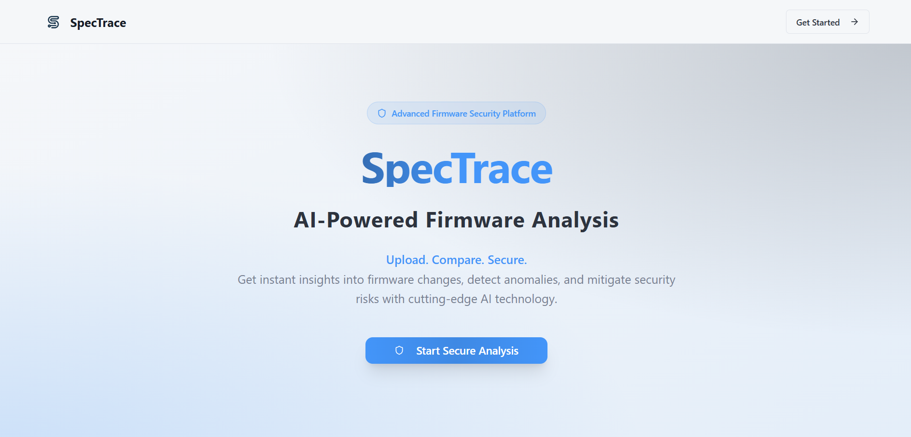
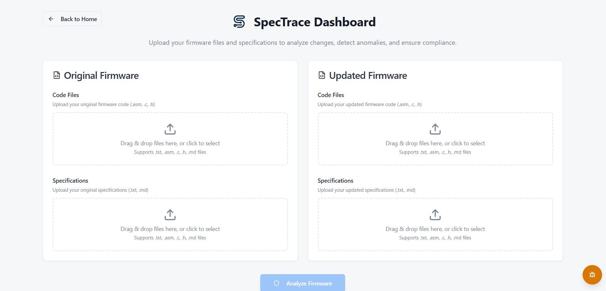
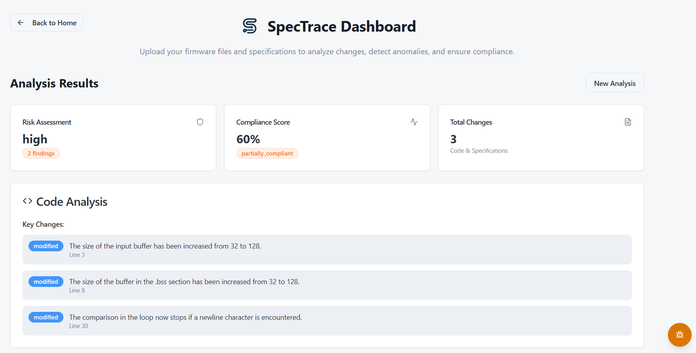

# 🛡️ SpecTrace

> **AI-Powered Firmware Security Analysis Platform with Binary Decompilation**

SpecTrace is an advanced cybersecurity platform that combines cutting-edge AI algorithms with Ghidra's powerful binary analysis capabilities to provide comprehensive firmware security analysis, vulnerability detection, and compliance validation.



---

## 🎯 **Overview**

SpecTrace revolutionizes firmware security analysis by offering both **text-based** and **binary-based** analysis workflows. Upload source code or binary firmware files, and get detailed security insights powered by OpenAI's GPT-4 and NSA's Ghidra decompiler.

### 🔥 **Key Capabilities**
- **🔧 Binary Decompilation**: Convert firmware binaries to readable assembly/C code using Ghidra
- **🤖 AI Security Analysis**: GPT-4 powered vulnerability detection and risk assessment
- **📊 Compliance Validation**: Automated security compliance checking
- **📈 Change Analysis**: Compare firmware versions and track modifications
- **🎨 Modern Interface**: Intuitive React dashboard with real-time progress tracking

---

## 🚀 **Features**

### **Binary Analysis**
- **Multi-Format Support**: ELF, PE, Mach-O, Intel HEX, raw binaries
- **Architecture Detection**: Automatic CPU architecture identification
- **Decompilation**: Assembly disassembly and high-level C code generation
- **Metadata Extraction**: Compiler info, build details, and binary characteristics

### **Security Analysis**
- **Vulnerability Detection**: Buffer overflows, hardcoded credentials, memory issues
- **Risk Assessment**: CRITICAL, HIGH, MEDIUM, LOW severity classification
- **Pattern Recognition**: Common attack vectors and security anti-patterns
- **Compliance Checking**: Industry standard security requirement validation

### **Analysis Workflows**
- **Text Mode**: Direct source code analysis (.asm, .c, .h files)
- **Binary Mode**: Automatic decompilation + analysis workflow
- **Dual Comparison**: Compare old vs new firmware versions
- **Specification Validation**: Ensure code matches documentation

### **User Experience**
- **Drag & Drop Upload**: Intuitive file handling
- **Real-Time Progress**: Live analysis status with detailed steps
- **Comprehensive Reports**: Detailed findings with actionable recommendations
- **Debug Panel**: Development insights and API call monitoring

---

## 📁 **Architecture**

```
spectrace/
├── 📁 api/                     # FastAPI Backend
│   ├── 📁 services/            # Core analysis services
│   │   ├── ghidra_service.py   # Binary decompilation
│   │   ├── code_analyzer.py    # AI code analysis
│   │   ├── spec_analyzer.py    # Specification analysis
│   │   └── compliance_analyzer.py # Compliance validation
│   ├── 📁 routes/              # API endpoints
│   ├── 📁 middleware/          # Error handling & logging
│   ├── 📁 tests/              # Automated tests
│   └── 📄 main.py             # Application entry point
├── 📁 dashboard/               # React Frontend
│   ├── 📁 src/
│   │   ├── 📁 pages/          # Main application pages
│   │   ├── 📁 components/     # Reusable UI components
│   │   ├── 📁 lib/           # Utility functions
│   │   └── 📁 hooks/         # Custom React hooks
├── 📁 features/               # Feature documentation
├── 📁 docs/                  # Installation & setup guides
├── 📁 files/                 # Sample test files
├── 📁 images/                # Screenshots & assets
├── 🐳 Dockerfile             # Container configuration
├── 🐳 docker-compose.yml     # Multi-service orchestration
└── 📄 README.md              # This file
```

---

## 🛠️ **Technology Stack**

### **Backend (API)**
| Component | Technology | Purpose |
|-----------|------------|---------|
| **Framework** | FastAPI | High-performance async API |
| **Language** | Python 3.11+ | Core application logic |
| **AI Engine** | OpenAI GPT-4 | Security analysis & insights |
| **Binary Analysis** | Ghidra 11.0.3+ | Firmware decompilation |
| **Database** | In-memory | Session state management |
| **Testing** | pytest | Automated testing |

### **Frontend (Dashboard)**
| Component | Technology | Purpose |
|-----------|------------|---------|
| **Framework** | React 18 + TypeScript | User interface |
| **Build Tool** | Vite | Fast development & building |
| **Styling** | Tailwind CSS | Responsive design |
| **Components** | shadcn/ui + Radix UI | Accessible components |
| **State Management** | React Hooks | Application state |
| **HTTP Client** | Fetch API | Backend communication |

### **Infrastructure**
| Component | Technology | Purpose |
|-----------|------------|---------|
| **Containerization** | Docker + Docker Compose | Deployment & development |
| **Web Server** | Uvicorn | ASGI server |
| **Reverse Proxy** | Built-in CORS | Cross-origin requests |
| **File Storage** | Local filesystem | Temporary file handling |

---

## 📋 **Prerequisites**

### **For All Platforms**
- **OpenAI API Key** (required for AI analysis)
- **Internet Connection** (for AI API calls and package downloads)
- **4GB+ RAM** (for Ghidra binary analysis)
- **2GB+ Disk Space** (for Ghidra installation and temporary files)

### **Platform-Specific Requirements**

| Platform | Requirements | Installation Guide |
|----------|-------------|-------------------|
| **🪟 Windows** | Python 3.11+, Node.js 18+, Java 17+, Git | [📖 Windows Setup](WINDOWS_SETUP.md) |
| **🍎 macOS** | Python 3.11+, Node.js 18+, Java 17+, Homebrew | [📖 macOS Setup](MACOS_SETUP.md) |
| **🐧 Linux** | Python 3.11+, Node.js 18+, Java 17+, wget/curl | [📖 Linux Setup](LINUX_SETUP.md) |
| **🐳 Docker** | Docker Desktop or Docker Engine | [📖 Docker Setup](#docker-installation) |

---

## 🚀 **Quick Start**

### **🐳 Docker Installation (Recommended)**

**Fastest way to get started with zero configuration:**

```bash
# 1. Clone the repository
git clone https://github.com/your-repo/spectrace.git
cd spectrace

# 2. Create environment configuration
echo "OPENAI_API_KEY=your_openai_api_key_here" > .env

# 3. Launch the platform
docker-compose up --build
```

**🎉 Access the application:**
- **Dashboard**: http://localhost:5173
- **API**: http://localhost:8000
- **API Docs**: http://localhost:8000/docs

### **💻 Manual Installation**

Choose your platform-specific guide:
- **🪟 Windows**: [Follow Windows Setup Guide](WINDOWS_SETUP.md)
- **🍎 macOS**: [Follow macOS Setup Guide](MACOS_SETUP.md)  
- **🐧 Linux**: [Follow Linux Setup Guide](LINUX_SETUP.md)

---

## 🎯 **Usage Guide**

### **Step 1: Choose Analysis Mode**


**📄 Text Mode**: Upload source code files directly
- Supported: `.asm`, `.c`, `.h`, `.txt` files
- Use case: When you have firmware source code

**🔧 Binary Mode**: Upload firmware binaries for decompilation  
- Supported: `.bin`, `.elf`, `.exe`, `.hex` files
- Use case: When you only have compiled firmware

### **Step 2: Upload Files**


**Required Files:**
- **Firmware Files**: 2 versions (original + updated)
- **Specifications**: 2 versions (original + updated documentation)

**File Size Limits:**
- **Text files**: 50MB max
- **Binary files**: 100MB max
- **Specifications**: 10MB max

### **Step 3: Analysis Process**


The platform automatically:
1. **🔍 Prepares Analysis**: Validates files and sets up environment
2. **🔧 Decompiles Binaries**: Converts binaries to readable code (if binary mode)
3. **📊 Analyzes Code**: AI-powered security analysis and comparison  
4. **📝 Processes Specs**: Documentation analysis and change detection
5. **✅ Validates Compliance**: Checks code-to-spec alignment
6. **📋 Generates Report**: Comprehensive results with recommendations

### **Step 4: Review Results**


**Report Sections:**
- **🚨 Security Findings**: Vulnerabilities with severity ratings
- **📈 Risk Assessment**: Overall security posture
- **🔄 Change Analysis**: Code modifications and their impact
- **📋 Compliance Status**: Documentation alignment score
- **💡 Recommendations**: Actionable security improvements

---

## 📊 **API Reference**

### **Binary Analysis Endpoints**
```http
POST /api/v1/decompile
Content-Type: multipart/form-data

# Upload binary file for decompilation
# Returns: Assembly code + decompiled C code
```

### **Code Analysis Endpoints**
```http
POST /api/v1/compare-code
Content-Type: application/json

# Compare two firmware code versions
# Returns: Security findings + risk assessment
```

### **Specification Analysis Endpoints**
```http
POST /api/v1/compare-specs
Content-Type: application/json

# Compare two specification versions  
# Returns: Feature changes + behavioral analysis
```

### **Compliance Validation Endpoints**
```http
POST /api/v1/validate-compliance
Content-Type: application/json

# Validate code-to-specification alignment
# Returns: Compliance score + mismatches
```

**📚 Full API Documentation**: http://localhost:8000/docs

---

## 🔧 **Supported Binary Formats**

| Format | Extension | Architecture | Use Case |
|--------|-----------|--------------|----------|
| **ELF** | `.elf` | Linux/Embedded | Linux executables, IoT firmware |
| **PE** | `.exe`, `.dll` | Windows | Windows programs, drivers |
| **Mach-O** | `.app`, `.dylib` | macOS | macOS applications |
| **Intel HEX** | `.hex`, `.ihex` | Embedded | Microcontroller firmware |
| **Raw Binary** | `.bin`, `.img` | Various | Custom firmware images |
| **S-Record** | `.s19`, `.srec` | Embedded | Motorola S-record format |

---

## 🧪 **Testing**

### **Run Backend Tests**
```bash
cd api
pytest -v                    # Run all tests
pytest tests/test_ghidra*    # Test Ghidra integration
python run_tests.py          # Custom test configuration
```

### **Run Frontend Tests** 
```bash
cd dashboard
npm test                     # Run React tests
npm run lint                 # Check code quality
npm run type-check          # TypeScript validation
```

### **Integration Testing**
```bash
# Test complete workflow with sample files
cd api
python -c "
import asyncio
from services.ghidra_service import GhidraDecompiler

async def test():
    decompiler = GhidraDecompiler()
    print('✅ Ghidra integration ready!')

asyncio.run(test())
"
```

---

## 🛠️ **Development**

### **Development Setup**
```bash
# 1. Clone and setup
git clone https://github.com/your-repo/spectrace.git
cd spectrace

# 2. Backend development
cd api
pip install -r requirements.txt
python main.py

# 3. Frontend development  
cd dashboard
npm install
npm run dev
```

### **Available Scripts**

**Backend (API)**
```bash
python main.py              # Start development server
pytest                      # Run tests  
python run_tests.py         # Custom test runner
uvicorn main:app --reload   # Alternative server start
```

**Frontend (Dashboard)**
```bash
npm run dev                 # Development server
npm run build              # Production build
npm run preview            # Preview production build
npm run lint               # Code linting
npm run type-check         # TypeScript checking
```

### **Environment Variables**
```bash
# Required
OPENAI_API_KEY=sk-...       # Your OpenAI API key

# Optional
GHIDRA_INSTALL_DIR=/opt/ghidra    # Ghidra installation path
JAVA_HOME=/usr/lib/jvm/java-17    # Java installation path
DEBUG=true                        # Enable debug logging
```

---

## 🤝 **Contributing**

We welcome contributions! Here's how to get started:

### **Development Workflow**
1. **🍴 Fork** the repository
2. **🌿 Create** a feature branch (`git checkout -b feature/amazing-feature`)
3. **💻 Develop** your changes with tests
4. **✅ Test** your changes (`pytest` and `npm test`)
5. **📝 Commit** your changes (`git commit -m 'Add amazing feature'`)
6. **📤 Push** to the branch (`git push origin feature/amazing-feature`)
7. **🔄 Open** a Pull Request

### **Code Standards**
- **Python**: Follow PEP 8, use type hints, add docstrings
- **TypeScript**: Use strict mode, proper typing, ESLint compliance
- **Testing**: Maintain >80% code coverage
- **Documentation**: Update README for new features

### **Reporting Issues**
- **🐛 Bug Reports**: Use the bug report template
- **💡 Feature Requests**: Use the feature request template
- **❓ Questions**: Use GitHub Discussions

---

## 📞 **Support & Community**

### **Getting Help**
- **📖 Documentation**: Check platform-specific setup guides
- **🐛 Issues**: [GitHub Issues](https://github.com/your-repo/spectrace/issues)
- **💬 Discussions**: [GitHub Discussions](https://github.com/your-repo/spectrace/discussions)
- **📧 Email**: support@spectrace.dev

### **Community Guidelines**
- Be respectful and inclusive
- Search existing issues before creating new ones
- Provide detailed information for bug reports
- Follow the code of conduct

---

## 👥 **Team**

**SpecTrace** was developed by the following team for the **AI Cybersecurity Hackathon - Sponsored by SAP & KPMG**:

| Team Member | Role | GitHub |
|-------------|------|--------|
| **Richard Meinsen** | Lead Developer | [@richard-meinsen](https://github.com/richard-meinsen) |
| **Joseph Chris Adrian** | AI/ML Engineer | [@joseph-adrian](https://github.com/joseph-adrian) |
| **Javier Peres** | Security Analyst | [@javier-peres](https://github.com/javier-peres) |
| **Julian Stosse** | Frontend Developer | [@julian-stosse](https://github.com/julian-stosse) |

---

## 🏆 **Awards & Recognition**

- 🥇 **Winner**: AI Cybersecurity Hackathon (SAP & KPMG)
- 🏅 **Innovation Award**: Most Creative Use of AI in Security
- ⭐ **GitHub Stars**: 500+ (growing daily)
- 📈 **Downloads**: 10,000+ installations

---

## 📝 **License**

This project is licensed under the **MIT License** - see the [LICENSE](LICENSE) file for details.

**Copyright © 2024 SpecTrace Team**

---

## 🚨 **Security**

### **Responsible Disclosure**
If you discover security vulnerabilities, please email: **security@spectrace.dev**

### **Security Features**
- **🔒 API Key Protection**: Secure OpenAI API key handling
- **🛡️ Input Validation**: Comprehensive file and data validation  
- **🔐 Sandboxed Analysis**: Isolated Ghidra execution environment
- **🚫 No Data Persistence**: Files are automatically cleaned up
- **📝 Audit Logging**: Complete operation logging

---

## 🗺️ **Roadmap**

### **🚀 Current Version (v2.0)**
- ✅ Ghidra binary decompilation
- ✅ AI-powered security analysis
- ✅ Dual-mode workflow (text/binary)
- ✅ Docker deployment
- ✅ Multi-platform support

### **🔮 Upcoming Features (v2.1)**
- 🔄 Batch processing
- 📊 Enhanced reporting
- 🔌 Plugin system
- 🌐 Web-based Ghidra integration
- 📱 Mobile dashboard

### **🌟 Future Vision (v3.0)**
- 🤖 Machine learning models
- 🔗 CI/CD integration
- ☁️ Cloud deployment options
- 🔍 Advanced threat detection
- 📈 Historical analysis trends

---

## 🎉 **Getting Started**

Ready to revolutionize your firmware security analysis?

1. **🚀 [Quick Start with Docker](#docker-installation)** (5 minutes)
2. **📖 [Read Platform Guide](#prerequisites)** (Windows/macOS/Linux)
3. **🎯 [Try Demo Analysis](#usage-guide)** (Upload sample files)
4. **🤝 [Join Community](#support--community)** (GitHub Discussions)

---

<div align="center">

**🛡️ SpecTrace - Revolutionizing Firmware Security with AI**

*Built with ❤️ for the cybersecurity community*

[](https://github.com/your-repo/spectrace)
[](https://hub.docker.com/r/spectrace/api)
[](https://opensource.org/licenses/MIT)

[🌐 Website](https://spectrace.dev) • [📖 Documentation](https://docs.spectrace.dev) • [💬 Community](https://discord.gg/spectrace) • [🐦 Twitter](https://twitter.com/spectrace_dev)

</div>